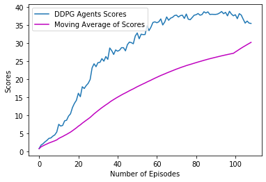

## Project 2 Report - Continuous Control

### Introduction

This project trained 20 double-jointed robotic arms (agents) to move to target locations and make contact with the green spheres in the environment

A reward of +0.1 is was given for each step that the agent's hand is in the goal location. Thus, the goal of the agents were to maintain thier positions at the target location for as many time steps as possible.

The observation space had 33 variables corresponding to position, rotation, velocity, and angular velocities of the arm. Each action being a vector with four numbers, corresponding to torque applicable to two joints. Every entry in the action vector should was a number between -1 and 1.

The goal is for the agents was to solve the environment and achive an average score of 30.0 over 100 consecutive episodes.

### Learning Algorithm

Deep Derterministic Policy Gradient (DDPG) was the algorithm used to solve this environment adopted from the Udacity Pendulum exercise and made slight modifications. DDPG learning algorithm allows the agent to learn directly from the un-processed observation spaces without knowing the domain dynamic information. The general concept of this algorithm is to use policy and value based methods with Actor - Critic methods.

The DDPG funciton uses the policy based approach to find the optimal policy and maximize reward using gradient descent (Actor) while the value based approach estimates the value for future rewards (Critic).

The environment was solved by the agents getting an average score of 30.22 above the target score of 30.0 in 109 episodes.

The network architecture model had two Deep Neural Networks (DNN) one for the Actor and the other for the Critic. The both had three (3) linear layers with RELU as the activation function for each layer and batch normalization for the first hidden layer in the model.py file between the input state size and output actions size.

##### The Learning algorithm uses the following:
* ***Actor-Critic DNN method*** where the actor agent lerans how to estimate the optimal policy and the critic agent learns how to estimate the value of different state-action pairs.
* ***Batch Normalization*** was used to for the fc1 hidden layer to optimize mini batches training.
* ***Gradient Clipping*** apply gradient clipping after the backward pass to prevent exploding grdients when training the critic network.
* ***Learn Interval and Update at Timesteps*** to allow the actor and critic agent to learn at intervals of 20 timesteps and improve the agents performance.
* ***Experience replay*** to train through mini-batches from the replay buffer by sampling experiences uniformly at random from the replay memory and gather experiences from each agent.

The hyperparameters used to train the DDPG Agent were:
* BUFFER_SIZE = int(1e6) 
* BATCH_SIZE = 128    
* GAMMA = 0.99          
* TAU = 1e-3             
* LR_ACTOR = 1e-3        
* LR_CRITIC = 1e-3      
* WEIGHT_DECAY = 0    
* LEARN_EVERY = 20      
* LEARN_NUM = 10         
* OU_SIGMA = 0.2        
* OU_THETA = 0.15        
* EPSILON = 1.0           
* EPSILON_DECAY = 1e-6      
* n_episodes=1000
* max_t=1000

### Trained DDPG Results

The figure below shows the trained 20 DDPG Agent results with a moving average score. The average score was 30.22 in 109 episodes.

### Ideas For Future Network

This project has utilized the Deep Derterministic Policy Gradient (DDPG). For further and future work, I plant to try out other algorithms to see how they perform in comparison to DDPG:
1. ***Proximal Policy Optimization (PPO)***
2. ***Distributional Deterministic Policy Gradients (D4PG)***
3. ***Add Prioritized Experience Replay to DDPG*** 
